# GetCoolProteopipe workflow


### Introduction

The **GetCoolProteopipe** (GCP) package is the coolest R-package for
downstream analysis of MaxQuant proteomics outputs!

The package enables reproducible processing for non-programmers in the R
environment, including data transformation, normalisation, missing-value
imputation, batch effect correction, statistical inference and
publication-ready visualisation; all in a single unified pipeline!

With GCP you can perform elaboration of both global proteomics and
post-translational modifications (PTMs) analysis, and the way the latter
is computed is a key novelty of this package!

In this vignette you will find a suggested workflow with an example
dataset. Moreover, an R-script covering this same workflow can be
downloaded from this GitHub repository at:
‘GetCoolProteopipe/inst/scripts/20260424_vignette_workflow.R’.

### Citation

If you use the package, please cite:

Frigerio G, Ansermino C, Andolfo A, Braccia C. GetCoolProteopipe
R-package (2026). GitHub repository.
<https://github.com/FrigerioGianfranco/GetCoolProteopipe>.

### Installation

Before installing, ensure the following are installed:

- R (version ≥ 4.3.1)
- Java (JDK), with the same architecture as R (64-bit or 32-bit).
- Git

Then open R (or RStudio) and run the following in the R console:

``` r

if (!require("devtools", quietly = TRUE)) {install.packages("devtools")}

devtools::install_github("FrigerioGianfranco/GetCoolProteopipe", dependencies = TRUE)
```

Follow the on-screen instructions to install all the dependencies.

#### Troubleshooting

If an error occurs, try again by running R with administrator privileges
(right-click R and select Run as administrator). If the error persists,
please contact me. Thank you for reporting any issues!

Remember that the R architecture (64-bit or 32-bit) must match your Java
architecture. You can check R’s architecture by running in the R
console:

``` r

R.version$arch
```

To check Java’s architecture, open Command Prompt and run:

``` r

java -version
```

If the architectures do not match, re-install R or Java from the
official websites. I recommend using the 64-bit architecture for both.

### Loading the package

To start cool proteomics data elaboration, run the following code to
load the package:

``` r

library(GetCoolProteopipe)
```


## Untargeted proteomics

### Import of MaxQuant output

Everything begins with the data import. For this vignette, we will use
the data from a study published in 2025 (doi paper:
10.1038/s41419-025-07595-z; doi raw data: 10.6019/PXD054747), in which
mouse muscle tissues were analyzed by both untargeted proteomics and
PTM-based approaches.

The *ImportOutputMaxQuant()* function will import your data, pay
attention for the most important arguments:

- MaxQuant_table_name: the “proteinGroups.txt” file (or the path file)
  as exported from MaxQuant within the txt folder.
- samples_info: This is optional, but if you have some metadata table
  about your samples, such as which samples belong to certain sample
  groups, you can upload it here by passing its file name (or the path
  file).
- fasta_database: you could leave it as missing; but if you want to fill
  the missing Protein names and Gene names from MaxQuant, you can
  specify either “human” or “mouse” (in this case the package will use
  pre-loaded fasta tables) or if you have your own fasta table you can
  write here that file name (or the path file) and it will be
  considered. The `fasta` input used in this function is a simplified
  version of the reference proteome FASTA file downloaded from the
  UniProt website on 05/03/2024 (or, more generally, the same FASTA file
  used for the MaxQuant search). The original FASTA file is adapted into
  a tabular format containing only three fields required for annotation:
  Accession, Protein name, and Gene name.
- raw_or_LFQ: the output of MaxQuant usually has both raw intenstities
  and such intensities normalised with the “LFQ” (Label-Free
  Quantification) algorithm. Choose here which ones you want here to be
  imported for your elaborations.
- prioritize_MaxQuant_names; in case of different Protein name and Gene
  names from the fasta database and what imported from MaxQuant, here
  you can specify with TRUE if you want to prioritise names from
  MaxQuant.
- remove_identified_by_site, remove_reverse,
  remove_potential_contaminant: pass TRUE to these argument if you want
  to remove rows with those characteristics (an overview of this
  operation will be printed in the console)

``` r

proteinGroups_path <- system.file("extdata", "proteinGroups_vignettes.txt.gz", package = "GetCoolProteopipe")

GCPlist00 <- ImportOutputMaxQuant(MaxQuant_table_name = proteinGroups_path,   ## you can just put the name of your file in your current working directory
                                  samples_info = NULL,                       ## also here potentially
                                  fasta_database = "mouse",
                                  raw_or_LFQ = "raw",
                                  prioritize_MaxQuant_names = TRUE,
                                  remove_identified_by_site = TRUE,
                                  remove_reverse = TRUE,
                                  remove_potential_contaminant = TRUE)
#> 
#> ___
#> At first, 1478 rows were imported
#> ...from which, 54 'Only identified by site' were removed
#> ...from which, 14 'Reverse' were removed
#> ...from which, 19 'Potential contaminant' were removed
#> In the end, 1391 rows were kept
#> ___
#> 
#>  -- raw intensities are being imported --
```

Great, this creates the so-called “GCP list”! Throughout the while
workflow, we will keep working on this list, which will always be made
of 3 data frames:

- intensities: each row is a protein, uniquely identified by the column
  ‘protid’, while each other column is a sample.

``` r

head(GCPlist00$intensities)
#> # A tibble: 6 × 11
#>   protid       S1     S2     S3     S4     S5     V1     V2     V3     V4     V5
#>   <chr>     <dbl>  <dbl>  <dbl>  <dbl>  <dbl>  <dbl>  <dbl>  <dbl>  <dbl>  <dbl>
#> 1 prot000… 2.70e8 0      1.19e8 1.33e8 2.86e7 2.12e8 2.06e8 1.60e8 1.81e8 6.37e7
#> 2 prot000… 8.47e7 0      1.64e8 1.50e7 0      1.51e7 1.36e8 1.60e8 2.32e8 3.96e7
#> 3 prot000… 3.36e7 0      2.08e7 3.16e7 3.10e7 6.95e6 0      2.44e7 2.23e7 2.59e7
#> 4 prot000… 6.82e8 2.69e8 1.95e8 1.32e8 6.10e8 1.50e8 6.55e8 3.06e8 2.41e8 3.31e8
#> 5 prot000… 3.44e8 9.48e7 9.37e7 7.89e7 6.36e7 3.03e7 5.56e7 1.27e8 4.57e7 1.03e8
#> 6 prot000… 6.64e7 0      5.48e6 0      1.26e7 0      0      2.46e7 4.18e6 1.28e7
```

- proteinINFO: besides the ‘protid’ column, same as above, every column
  contains information related to that protein group.

``` r

head(GCPlist00$proteinINFO)
#> # A tibble: 6 × 102
#>   protid     `Protein IDs`         `Majority protein IDs` `Peptide counts (all)`
#>   <chr>      <chr>                 <chr>                  <chr>                 
#> 1 prot000000 A0A075B5P4;A0A0A6YWR… A0A075B5P4;A0A0A6YWR2… 2;2;2;2               
#> 2 prot000001 A0A075B5P6;A0A075B6A… A0A075B5P6;A0A075B6A0… 7;7;7;7               
#> 3 prot000002 A0A087WNP6;Q4VAA2-2;… A0A087WNP6;Q4VAA2-2;Q… 2;2;2;1               
#> 4 prot000003 A0A087WQE6;A0A087WNT… A0A087WQE6;A0A087WNT1… 5;5;5;3               
#> 5 prot000004 A0A087WQF8;A0A087WP4… A0A087WQF8;A0A087WP48… 9;9;9;9;9;9;9;9;9;9;9…
#> 6 prot000005 A0A087WPL5;E9QNN1;O7… A0A087WPL5;E9QNN1;O70… 2;2;2;2;2;1;1         
#> # ℹ 98 more variables: `Peptide counts (razor+unique)` <chr>,
#> #   `Peptide counts (unique)` <chr>, `Protein names_MaxQuant` <chr>,
#> #   `Gene names_MaxQuant` <chr>, `Fasta headers` <chr>,
#> #   `Number of proteins` <dbl>, Peptides <dbl>,
#> #   `Razor + unique peptides` <dbl>, `Unique peptides` <dbl>,
#> #   `Peptides S1` <dbl>, `Peptides S2` <dbl>, `Peptides S3` <dbl>,
#> #   `Peptides S4` <dbl>, `Peptides S5` <dbl>, `Peptides V1` <dbl>, …
```

- sampleINFO: the information about the samples, for example the group
  each sample belongs to.

``` r

GCPlist00$sampleINFO
#> # A tibble: 10 × 1
#>    Sample
#>    <chr> 
#>  1 S1    
#>  2 S2    
#>  3 S3    
#>  4 S4    
#>  5 S5    
#>  6 V1    
#>  7 V2    
#>  8 V3    
#>  9 V4    
#> 10 V5
```

### Cleaning of imported data

It’s probably a good idea now to run *GCP_RemoveAllZero* to remove
proteins that have zero as intensity in all samples, especially if
working with LFQ intensities.

``` r

GCPlist01 <- GCP_RemoveAllZero(GCPlist00)
#> 
#> ___
#> There are 4 rows with all zero in the intensity table, which have been removed.
#> 
#> Thus, 1387 out of 1391 proteins were kept.
#> ___
```

…and then, since the output of MaxQuant usually marks as zero the
missing intensities, it’s better to replace them with actual missing
values with the function *GCP_ReplaceZerowithNA*:

``` r

GCPlist02 <- GCP_ReplaceZerowithNA(GCPlist01)
#> 
#> ______
#> The number of zeros replaced with NAs is
#>  - 1121 out of 13870 (8.1%).
#> ______
```

### Managing samples

Now, there are a bunch of functions that could be used to perform simple
operations directly and consistently on this list: the function names
are intuitive, and you can always check the full documentation to find
out about all their arguments: *GCP_RemoveSamples*,
*GCP_ReorderSamples*, *GCP_ChangeSampleNames*, *GCP_AssignGroups*.

Let’s see an example of two of them:

``` r

GCPlist03 <- GCP_ChangeSampleNames(GCPlist = GCPlist02,
                                   old_names = GCPlist02$sampleINFO$Sample,
                                   new_names = c("S_1", "S_2", "S_3", "S_4", "S_5", "V_1", "V_2", "V_3", "V_4", "V_5"))
#> 
#> ______
#> The name of samples have been updated in this way:
#> 
#>    ORIGINAL_NAMES NAMES_UPDATED    COMMENT
#> 1              S1           S_1   Changed!
#> 2              S2           S_2   Changed!
#> 3              S3           S_3   Changed!
#> 4              S4           S_4   Changed!
#> 5              S5           S_5   Changed!
#> 6              V1           V_1   Changed!
#> 7              V2           V_2   Changed!
#> 8              V3           V_3   Changed!
#> 9              V4           V_4   Changed!
#> 10             V5           V_5   Changed!
#> ______
```

``` r

GCPlist04 <- GCP_AssignGroups(GCPlist = GCPlist03,
                              automatic_assignment = "groupfirst",
                              separator_automatic_assignment = "_",
                              name_column_groups = "Condition",
                              controlgroup = "S")
#> 
#> ______
#> The groups have been assigned in the sampleINFO dataframes in the column named Condition, in this way:
#>    Sample Condition Replicate
#> 1     S_1         S         1
#> 2     S_2         S         2
#> 3     S_3         S         3
#> 4     S_4         S         4
#> 5     S_5         S         5
#> 6     V_1         V         1
#> 7     V_2         V         2
#> 8     V_3         V         3
#> 9     V_4         V         4
#> 10    V_5         V         5
#> 
#> 
#> The order of the levels is the following: S V
#> ______
```

Very important!! Either you imported the groups through an external
table which file name was passed to the argument ‘samples_info’ of the
function *ImportOutputMaxQuant*, or you created them with the function
*GCP_AssignGroups*, you might want to pass the name of the column of the
sampleINFO data frame that contains this group categorisation with the
function *set_name_column_groups*:

``` r

set_name_column_groups("Condition")
#> 
#>  --- the name_column_groups is now set to be 'Condition' ---
```

This will set an option in your working environment that, by default,
will pass that name to every function that has the argument
‘name_column_groups’ (and trust me, there are a lot!)

Likewise, to color those groups consistently in all the visualisations,
set the colors you want with the function *set_col_pal*

``` r

set_col_pal(c(S = "green", V = "orange"))
#> 
#>  --- the col_pal option is now set to be  c(S = "green", V = "orange") ---
```

In the example dataset we are using for this vignettes, the two sample
groups (defined in the column ‘Condition’ of the sampleINFO table) are
‘S’ and ‘V’. What we set ensures that all the visualisation considering
these groups will assign a green color to S and a blue color to V.

### Processing

Then, to ensure a better normal distribution of the data, a
log-transformation is strongly advised. Use the function
*GCP_LogTransformIntensities*:

``` r

GCPlist05 <- GCP_LogTransformIntensities(GCPlist = GCPlist04)
#> 
#>  -- The base of the logarithm considered is 2 --
#> 
#> 
#> ______
#> All intensities have been transformed using the logarithm base 2.
#> ______
```

A good idea might also be to remove proteins that are missing values for
too many samples. We can use *GCP_FilterNAperCondition* and a ratio of
0.5 means that a protein will be removed if it has more than 50% of
missing values in each condition (the conditions are defined, as always,
by how the option ‘name_column_groups’ is set; or it can be specified
explicitly the ‘name_column_groups’ argument).

``` r

GCPlist06 <- GCP_FilterNAperCondition(GCPlist = GCPlist05,
                                      ratio = 0.5)
#> 
#>  -- The name_column_groups considered is 'Condition' --
#> 
#> 
#> _____________________
#> For the intensities table:
#> - 1293 out of 1387 where suitable for S.
#> - 1309 out of 1387 where suitable for V.
#> --> Overall, 1339 out of 1387 have been kept in the intensities table.
#> ___________________
```

There is also another function useful to run just before the missing
value imputation, useful to check how the proteins are in common or not
among the groups:

``` r

GCPlist07 <- GCP_ProteinsGrouped(GCPlist06)
#> 
#>  -- The name_column_groups considered is 'Condition' --
#> 
#> 
#> The following columns have been added to the proteinINFO table:
#>  present_S
#>  present_V
#>  combination_Condition
```

And now it’s time to impute all those missing values! We’ll be doing it
with the scImpute() and tImpute() functions of the “PhosR” package, and
we’ll be doing it with a simple easy step using the function
*GCP_NAimputation*:

``` r

GCPlist08 <- GCP_NAimputation(GCPlist = GCPlist07,
                              quant_rate = 0.5)
#> 
#>  -- The name_column_groups considered is 'Condition' --
#> 
#> 
#> ______
#> In the intensities table, the number of NAs is:
#> - 779 / 13390 (5.8%), initially.
#> - 246 / 13390 (1.8%), after the scImpute.
#> - 0 / 13390 (0%), after the tImpute.
#> ______
```

At this point, we could further standardise the data, if you’re not
using LFQ intensities. I’d describe you the function
*GCP_ScaleIntensities*:

- first argument, as usual, the GCPlist;
- in the ‘subtract’ argument you should specify what to subtract,
  i.e. how to center the data. Choose “mean” if you what to subtract the
  mean or “median” to subtract the median. There is actually an
  additional option, “shift_median”, which I’ll describe later…. (a bit
  of suspense for it!);
- in the argument ‘divide’ you can specify how to scale the data among:
  “sd” to divide for the standard deviation, “sqrt_sd” to divide for the
  square root of the standard deviation, “maxmin” to divide by the range
  (the difference between the maximum and the minimum);
- by_sample should be TRUE to perform such centering and scaling per
  sample, or FALSE to perform it by protein.

If, and only if, by_sample is TRUE, and if you don’t want negative
values out of the centering operation, the option “shift_median” in the
argument subtract will center the value to the global median (by just
subtracting an offset). VERY IMPORTANT: if you do not specify anything
in the last argument ‘name_column_groups’, it will take what is set in
the option as usual, and this shift of the median will be performed
differently for each group: i.e.: each sample of a group will be
centered to the global median of its group. If you instead do not want
to perform such group-wise shift, but just a shift to the global median
of all the samples, remember to add and set the further argument
‘name_column_groups’ to NULL.

``` r

GCPlist09 <- GCP_ScaleIntensities(GCPlist = GCPlist08,
                                  subtract = "shift_median",
                                  divide = "sqrt_sd",
                                  by_sample = TRUE)
#> 
#>  -- The name_column_groups considered is 'Condition' --
#> 
#> 
#> ______
#> Intensities have been, by sample,
#>  centered to the global median for each sample group (according to the 'Condition' column),
#>  divided by the square root of the standard deviation.
#> ______
```

#### batch correction

I’m dedicating now a brief section for a very cool function that can
turn very useful in some specific cases: when you run the analyses of
your projects across different batches. Indeed, the function
*GCP_ComBat* is a wrapper that implement the batch effects adjustment
performed by the function ComBat from the “sva” R-package: All you need
is to pass to the ‘batch’ argument a numeric/factor vector with the
batch information (so this vector must be of the same length of the
samples) or a name of the column of sampleINFO containing such
information. The dataset we are using as example for this vignettes
doesn’t need such a batch effects correction, but in the example below I
create mock batches to show you how to use the function:

``` r

GCPlist09b <- GCPlist09

#### passing a numeric/factor vector directly to the 'batch' argument:

GCPlist09b1 <- GCP_ComBat(GCPlist = GCPlist09b,
                          batch = c(1, 2, 3, 1, 2, 3, 1, 2, 3, 1))
#> 
#> The adjustment for batch effects is performed assigning batches to samples in this way:
#>  Batch Sample
#>     1  S_1
#>     2  S_2
#>     3  S_3
#>     1  S_4
#>     2  S_5
#>     3  V_1
#>     1  V_2
#>     2  V_3
#>     3  V_4
#>     1  V_5
#> 
#> Also, a column called 'Batch' has been added to sampleINFO, containing those batch indications.
#> Found3batches
#> Adjusting for0covariate(s) or covariate level(s)
#> Standardizing Data across genes
#> Fitting L/S model and finding priors
#> Finding parametric adjustments
#> Adjusting the Data

#### passing a column name of sampleINFO, containing the numeric/factor vector, to the 'batch' argument:

GCPlist09b$sampleINFO[, "batches"] <- factor(c("batch1", "batch2", "batch3", "batch1", "batch2", "batch3", "batch1", "batch2", "batch3", "batch1"), levels = c("batch1", "batch2", "batch3"))

GCPlist09b2 <- GCP_ComBat(GCPlist = GCPlist09b,
                          batch = "batches")
#> 
#> The adjustment for batch effects is performed assigning batches to samples in this way:
#>  Batch Sample
#>     1  S_1
#>     2  S_2
#>     3  S_3
#>     1  S_4
#>     2  S_5
#>     3  V_1
#>     1  V_2
#>     2  V_3
#>     3  V_4
#>     1  V_5
#> Found3batches
#> Adjusting for0covariate(s) or covariate level(s)
#> Standardizing Data across genes
#> Fitting L/S model and finding priors
#> Finding parametric adjustments
#> Adjusting the Data
```

### Visualisation of data before and after processing

We could apply all of the following visualisation functions before and
after the processing, to see the difference!

The following function is not exactly a visualisation function, but it’s
to test the normal distribution of the intensities:

``` r

## before processing:
GCPlist04tn <- GCP_TestNormality(GCPlist04)
#> 
#> _____
#> There must be at least 3 non-missing values to perform a Shapiro-Wilk test:
#> for this reason, it is not being performed on 15 proteins.
#> 
#> According to the Shapiro-Wilk test,
#>  939 out of 1372 proteins (68.4%) are normally distributed
#>  433 out of 1372 proteins (31.6%) are not normally distributed
#> _____
#> 
#> The following columns have been added to the proteinINFO table:
#>  shap_test_result
#>  shap_test_pvalue
#>  shap_test_normally_distributed
```

``` r

## after processing:
GCPlist09tn <- GCP_TestNormality(GCPlist09)
#> 
#> _____
#> According to the Shapiro-Wilk test,
#>  1258 out of 1339 proteins (94%) are normally distributed
#>  81 out of 1339 proteins (6%) are not normally distributed
#> _____
#> 
#> The following columns have been added to the proteinINFO table:
#>  shap_test_result
#>  shap_test_pvalue
#>  shap_test_normally_distributed
```

As you can see from what is printed in the console, additional columns
have been added to the proteinINFO table of the list, in this case with
the results of the Shapiro-Wilk test. This will always happen when
applying a statistical test.

Ok, let’s now visualise for real our data so far! We have plenty of cool
functions, including: *GCP_DensityplotIntensities*,
*GCP_QQplotIntensities*, *GCP_BoxPlots*, *GCP_Dendogram*, *GCP_BarPlot*,
*GCP_Venn*. All the visualisation of this package is saved as a ggplot
object: this means that you can use the ggplot grammar to further edit
it. Moreover, you can use the function *export_figures* to quickly
export it, as showed below:

``` r

## before processing:
Fig01_IntensityDistribution_before_processing <- GCP_DensityplotIntensities(GCPlist = GCPlist04,
                                                                            Title = "Distribution of intensities, before processing")
# export_figures(Fig01_IntensityDistribution_before_processing)    ## this would create a .png file with that name on your current working directory

print(Fig01_IntensityDistribution_before_processing)
#> Warning: Removed 1121 rows containing non-finite outside the scale range
#> (`stat_bin()`).
#> Warning: Removed 1121 rows containing non-finite outside the scale range
#> (`stat_density()`).
```

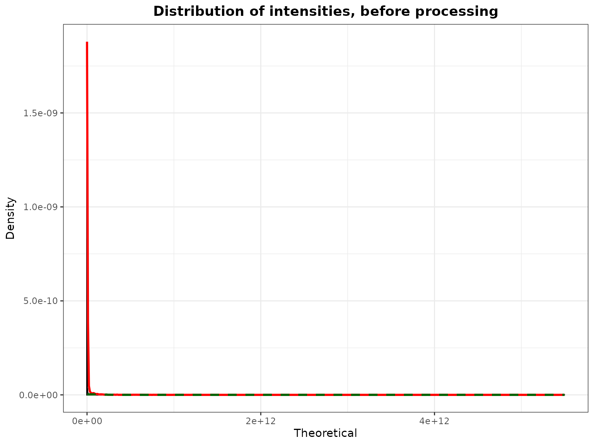

``` r

## after processing:
Fig02_IntensityDistribution_post_processing <- GCP_DensityplotIntensities(GCPlist = GCPlist09,
                                                                          Title = "Distribution of intensities, post processing")
# export_figures(Fig02_IntensityDistribution_post_processing)

print(Fig02_IntensityDistribution_post_processing)
```

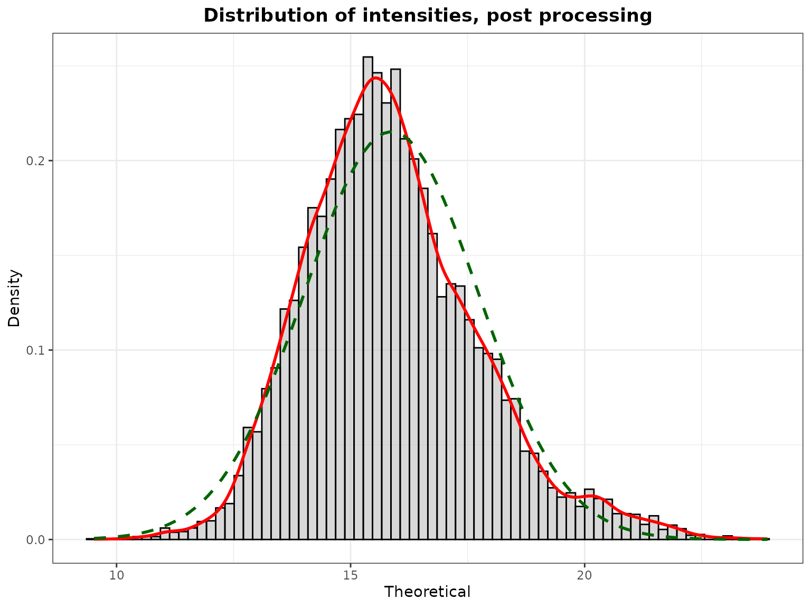

``` r

## before processing:
Fig03_QQ_plot_before_processing <- GCP_QQplotIntensities(GCPlist = GCPlist04,
                                                         Title = "QQ plot - before processing")
# export_figures(Fig03_QQ_plot_before_processing)

print(Fig03_QQ_plot_before_processing)
#> Warning: Removed 1121 rows containing non-finite outside the scale range
#> (`stat_qq()`).
#> Warning: Removed 1121 rows containing non-finite outside the scale range
#> (`stat_qq_line()`).
#> Removed 1121 rows containing non-finite outside the scale range
#> (`stat_qq_line()`).
```

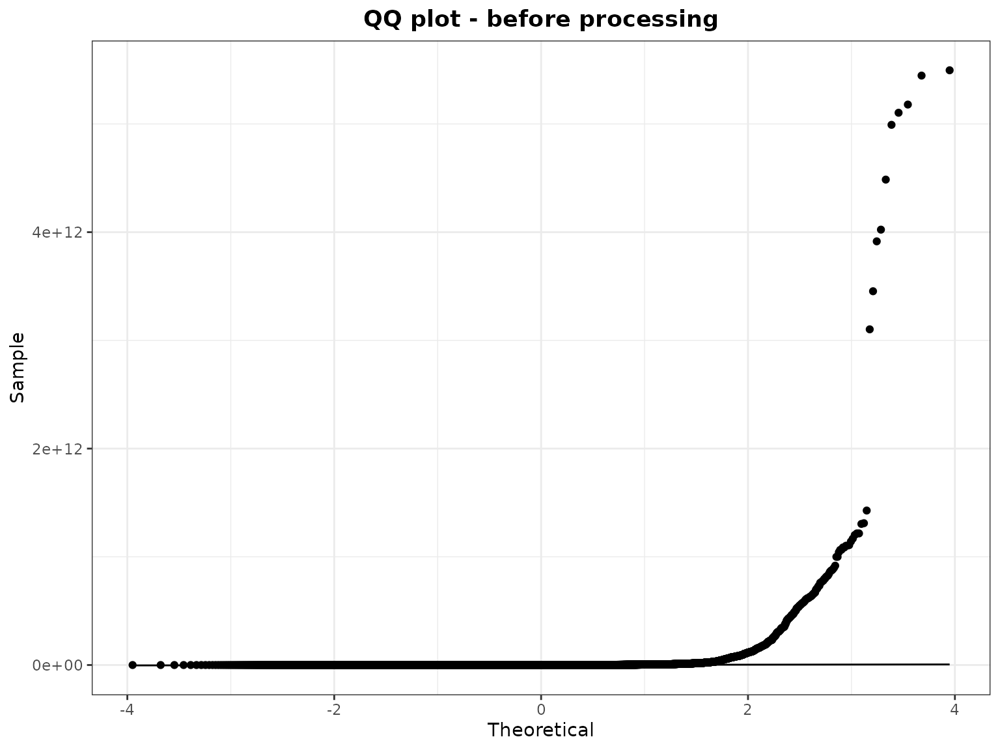

``` r

## after processing:
Fig04_QQ_plot_post_processing <- GCP_QQplotIntensities(GCPlist = GCPlist09,
                                                       Title = "QQ plot - post processing")
# export_figures(Fig04_QQ_plot_post_processing)

print(Fig04_QQ_plot_post_processing)
```

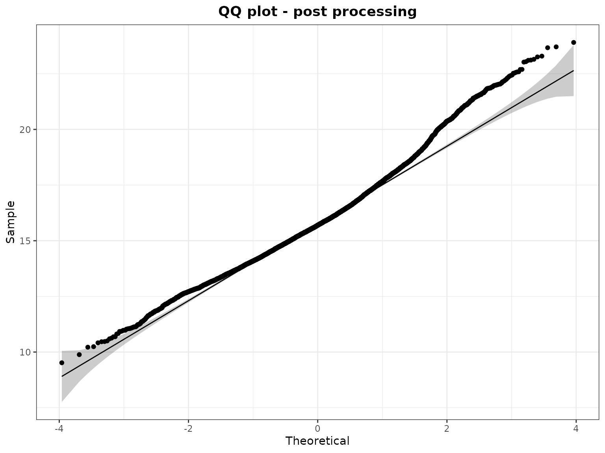

Great! Let’s look now at the bar plots of proteins per samples and at
the Venn graph showing proteins shared by the groups. To do so, use the
dataset just before performing the missing value imputation!

``` r

Fig05_BarPlot_post_filteringNA <- GCP_BarPlot(GCPlist = GCPlist07,
                                              label_numbers = TRUE,
                                              showCV = TRUE,
                                              rotate_sample_names = TRUE)
#> 
#>  -- The name_column_groups considered is 'Condition' --
#> 
#>  --- col_pal is  c(S = "green", V = "orange") ---
# export_figures(Fig05_BarPlot_post_filteringNA)

print(Fig05_BarPlot_post_filteringNA)
```

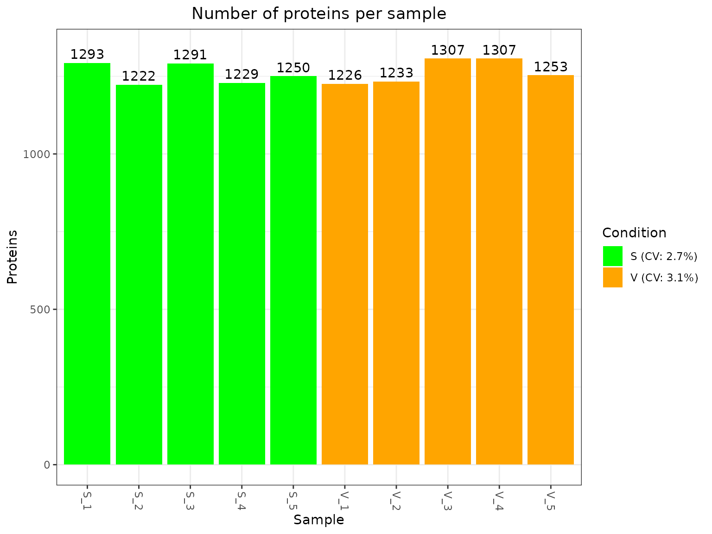

``` r

Fig06_Venn_post_filteringNA <- GCP_Venn(GCPlist07)
#> 
#>  -- The name_column_groups considered is 'Condition' --
#> 
#>  --- col_pal is  c(S = "green", V = "orange") ---
# export_figures(Fig06_Venn_post_filteringNA)

print(Fig06_Venn_post_filteringNA)
```

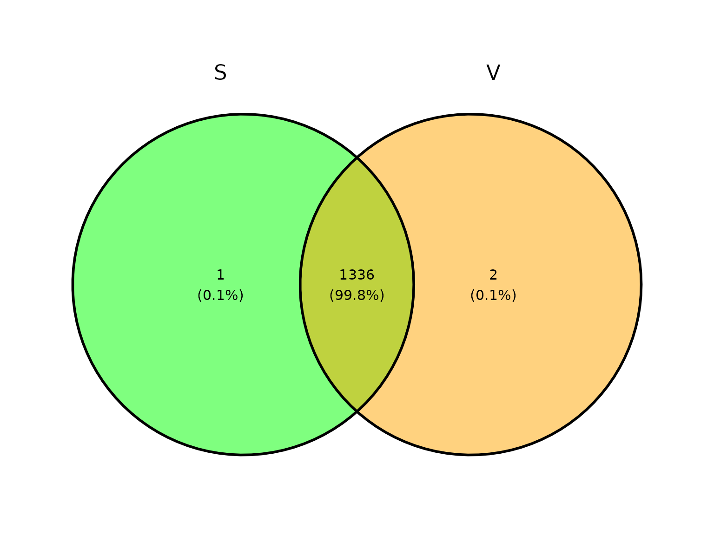

Look at the Venn graph we just created: curious to know more about those
lonely proteins, aren’t you?? Which one can they possibly be??? No need
to freak out!! Do you remember that we run *GCP_ProteinsGrouped* to mark
them on the proteinINFO table?

If, in addition to that, you want to have a nice overview, you can run
*GCP_ProteinsGroupedSummary* which should give you the same numbers in
the Venn graph. The added benefit is that, while Venn graph are limited
to a maximum of 4 groups, this approach can be applied to even more,
should you have!

``` r

SummaryTable_ProteinsGrouped_filteringNA <- GCP_ProteinsGroupedSummary(GCPlist07)
#> 
#>  -- The name_column_groups considered is 'Condition' --
# export_the_table(SummaryTable_ProteinsGrouped_filteringNA)   ## this would quickly export that table in your working directory!

print(SummaryTable_ProteinsGrouped_filteringNA)
#> # A tibble: 4 × 3
#>   combination_Condition     N    perc
#>   <fct>                 <int>   <dbl>
#> 1 ""                       48  3.46  
#> 2 "S"                       1  0.0721
#> 3 "V"                       2  0.144 
#> 4 "S_V"                  1336 96.3
```

Finally, here are some nice box plots and dendrograms:

``` r

## before processing:
Fig07_BoxPlot_before_processing <- GCP_BoxPlots(GCPlist = GCPlist04,
                                              by_samples = TRUE,
                                              Title = "Distribution of intensities, before processing")
#> 
#>  -- The name_column_groups considered is 'Condition' --
#> 
#>  --- col_pal is  c(S = "green", V = "orange") ---
# export_figures(Fig07_BoxPlot_before_processing)

print(Fig07_BoxPlot_before_processing)
#> Warning: Removed 1121 rows containing non-finite outside the scale range
#> (`stat_boxplot()`).
```

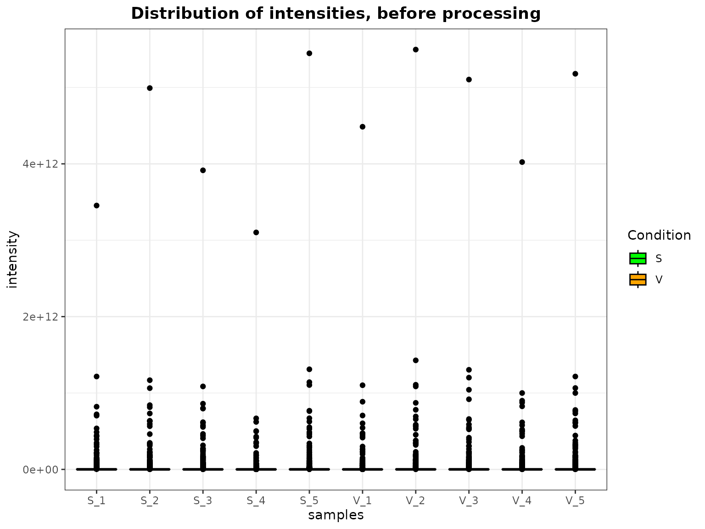

``` r

## after processing:
Fig08_BoxPlot_post_processing <- GCP_BoxPlots(GCPlist = GCPlist09,
                                              by_samples = TRUE,
                                              Title = "Distribution of intensities, post processing")
#> 
#>  -- The name_column_groups considered is 'Condition' --
#> 
#>  --- col_pal is  c(S = "green", V = "orange") ---
# export_figures(Fig08_BoxPlot_post_processing)

print(Fig08_BoxPlot_post_processing)
```

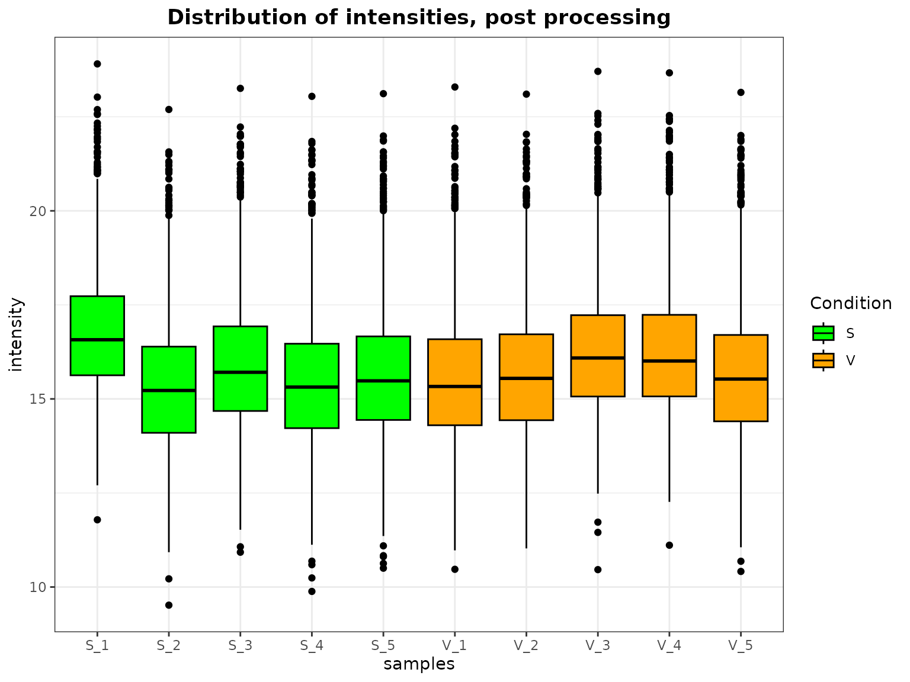

``` r

## before processing:
Fig09_Dendogram_before_processing <- GCP_Dendogram(GCPlist04)
#> 
#>  -- The name_column_groups considered is 'Condition' --
#> 
#>  --- col_pal is  c(S = "green", V = "orange") ---
# export_figures(Fig09_Dendogram_before_processing)

print(Fig09_Dendogram_before_processing)
```

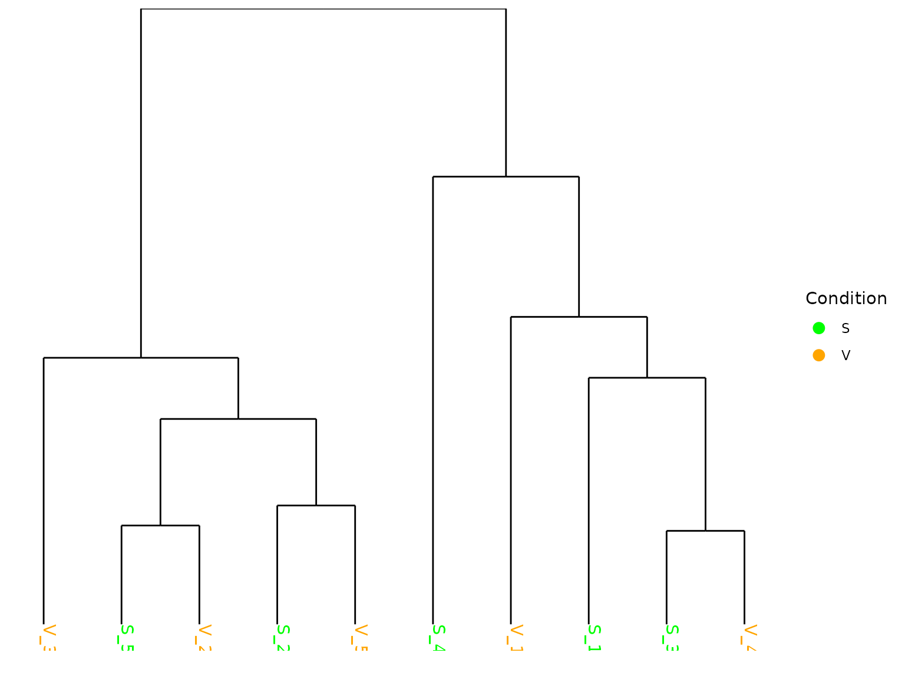

``` r

## after processing:
Fig10_Dendogram_post_processing <- GCP_Dendogram(GCPlist09)
#> 
#>  -- The name_column_groups considered is 'Condition' --
#> 
#>  --- col_pal is  c(S = "green", V = "orange") ---
# export_figures(Fig10_Dendogram_post_processing)

print(Fig10_Dendogram_post_processing)
```

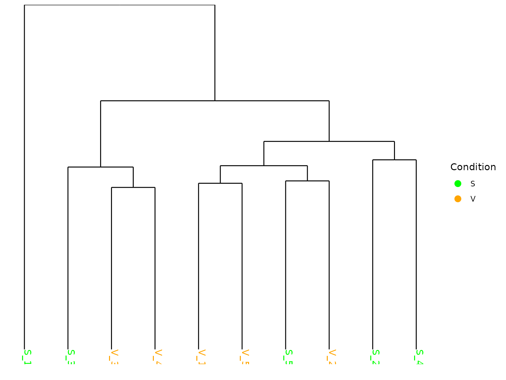

One more visualisation and unsupervised multivariate statistical
analysis: the Principal Component Analysis. There are two functions that
perform it: *GCP_plotPCA* produces a plot (a ggplot, as always!), while
*GCP_PCA()* actually computes the scores and the loadings of the
principal components and adds them to the sampleINFO table and
protinINFO table, respectively.

``` r

Fig11_PCA_score_plot <- GCP_plotPCA(GCPlist = GCPlist09,
                                    scores_or_loadings = "scores",
                                    PC_to_plot = c("PC1", "PC2"),
                                    name_column_labels = "Sample",
                                    ellipses_on_score = TRUE)
#> 
#>  -- The name_column_groups considered is 'Condition' --
#> 
#>  --- col_pal is  c(S = "green", V = "orange") ---
# export_figures(Fig11_PCA_score_plot)

print(Fig11_PCA_score_plot)
```

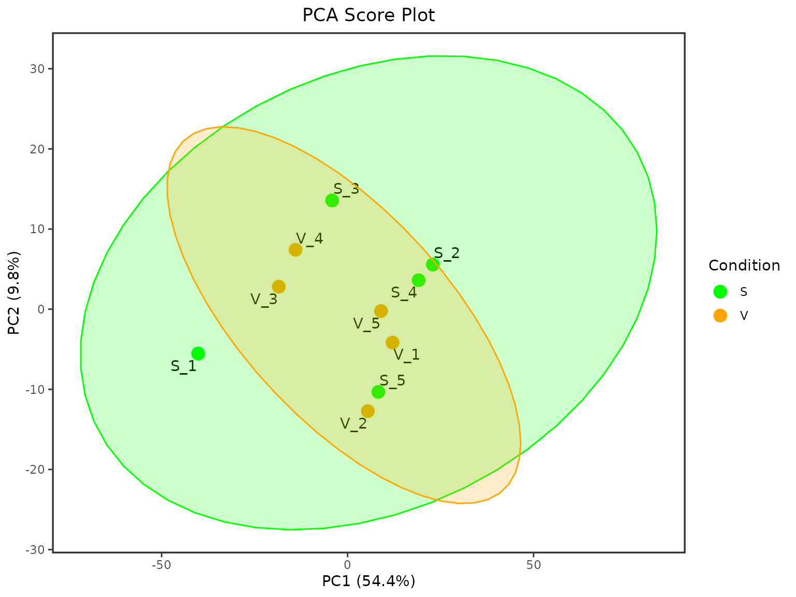

``` r

Fig12_PCA_loading_plot <- GCP_plotPCA(GCPlist = GCPlist09,
                                      scores_or_loadings = "loadings",
                                      PC_to_plot = c("PC1", "PC2"),
                                      name_column_groups_loading = NULL,
                                      name_column_labels_loading = "Protein names",
                                      col_pal_loading = NULL,
                                      ellipses_on_loading = FALSE)
#> 
#>  -- The name_column_groups considered is 'Condition' --
#> 
#>  --- col_pal is  c(S = "green", V = "orange") ---
# export_figures(Fig12_PCA_loading_plot)

print(Fig12_PCA_loading_plot)
```

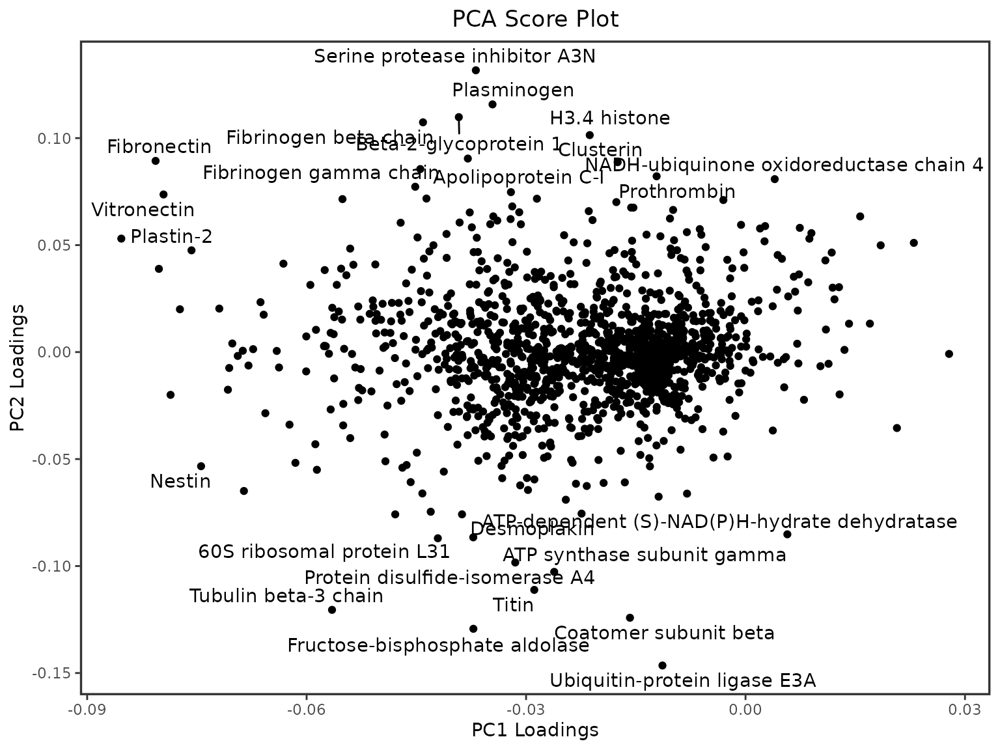

``` r

GCPlist10 <- GCP_PCA(GCPlist = GCPlist09)
#> 
#> The following columns have been added to the sampleINFO table:
#>  PC1_scores
#>  PC2_scores
#>  PC3_scores
#>  PC4_scores
#>  PC5_scores
#>  PC6_scores
#>  PC7_scores
#>  PC8_scores
#>  PC9_scores
#>  PC10_scores
#> 
#> The following columns have been added to the proteinINFO table:
#>  PC1_loadings
#>  PC2_loadings
#>  PC3_loadings
#>  PC4_loadings
#>  PC5_loadings
#>  PC6_loadings
#>  PC7_loadings
#>  PC8_loadings
#>  PC9_loadings
#>  PC10_loadings
```

### Statistics

In the example dataset we are looking at in this vignette we have two
groups: that’s the perfect scenario for running a t-test. The following
code provides an example of how to use *GCP_ttest* to perform a paired
t-test, with the additional Benjamini-Hochberg False Discovery Rate
(FDR) p-value correction.

``` r

GCPlist11 <- GCP_ttest(GCPlist = GCPlist10,
                       paired = TRUE,
                       FDR = TRUE,
                       pcutoff = 0.05)
#> 
#>  -- The name_column_groups considered is 'Condition' --
#> 
#> 
#> The following columns have been added to the proteinINFO table:
#>  ttest_Pvalues
#>  ttest_PvaluesFDR
#>  ttest_group_diff
#>  ttest_group_diff_FDR
```

We might want to also look at the Fold Change with the function
*GCP_FoldChange*! The following code computes a paired Fold Change (FC)
analysis on our data. Note that passing TRUE to the argument
‘are_log_transf’ will tell to the algorithm that the data are
log-transformed, and so the FC will be actually calculated with a
subtraction, instead of a division! Also, even if it’s not reported in
the example below, a potential further argument ‘control_group’ would
allow you to set what you want as control group, just to be sure.

``` r

GCPlist12 <- GCP_FoldChange(GCPlist = GCPlist11,
                            paired = TRUE,
                            are_log_transf = TRUE)
#> 
#>  -- The name_column_groups considered is 'Condition' --
#> 
#> 
#> "S" has been used as control group. If that is not fine for you, specify which group you want in the argument control_group
#> 
#> 
#>  -- The log_base considered is 2 --
#> 
#> 
#> The following columns have been added to the proteinINFO table:
#>  V_vs_S_FC
#>  V_vs_S_logFC
```

If you have more than two groups, you would instead run an ANOVA
analysis. Below I’m going to create four mock groups and run a one-way
ANOVA with Tukey HSD post-hoc test with *GCP_ANOVA*, and also FC
analyses considering all group pairs with *GCP_FoldChange_Multi*.

``` r

GCPlist12a <- GCPlist12
GCPlist12a$sampleINFO[, "Group_multi"] <- factor(c("gr1", "gr1", "gr2", "gr2", "gr3", "gr3", "gr3", "gr4", "gr4", "gr4"), levels = c("gr1", "gr2", "gr3", "gr4"))


GCPlist12a1 <- GCP_ANOVA(GCPlist = GCPlist12a,
                         name_column_groups = "Group_multi")
#> 
#>  -- The name_column_groups considered is 'Group_multi' --
#> 
#> 
#> The following columns have been added to the proteinINFO table:
#>  ANOVA_Group_multi_Pvalue
#>  ANOVA_gr2_vs_gr1_Pvalue
#>  ANOVA_gr3_vs_gr1_Pvalue
#>  ANOVA_gr4_vs_gr1_Pvalue
#>  ANOVA_gr3_vs_gr2_Pvalue
#>  ANOVA_gr4_vs_gr2_Pvalue
#>  ANOVA_gr4_vs_gr3_Pvalue
#>  ANOVA_Group_multi_PvalueFDR
#>  ANOVA_gr2_vs_gr1_PvalueFDR
#>  ANOVA_gr3_vs_gr1_PvalueFDR
#>  ANOVA_gr4_vs_gr1_PvalueFDR
#>  ANOVA_gr3_vs_gr2_PvalueFDR
#>  ANOVA_gr4_vs_gr2_PvalueFDR
#>  ANOVA_gr4_vs_gr3_PvalueFDR
#>  ANOVA_gr2_vs_gr1
#>  ANOVA_gr3_vs_gr1
#>  ANOVA_gr4_vs_gr1
#>  ANOVA_gr3_vs_gr2
#>  ANOVA_gr4_vs_gr2
#>  ANOVA_gr4_vs_gr3
#>  ANOVA_gr2_vs_gr1_FDR
#>  ANOVA_gr3_vs_gr1_FDR
#>  ANOVA_gr4_vs_gr1_FDR
#>  ANOVA_gr3_vs_gr2_FDR
#>  ANOVA_gr4_vs_gr2_FDR
#>  ANOVA_gr4_vs_gr3_FDR
```

``` r

GCPlist12a2 <- GCP_FoldChange_Multi(GCPlist = GCPlist12a1,
                                  name_column_groups = "Group_multi",
                                  paired = FALSE,
                                  are_log_transf = TRUE)
#> 
#>  -- The name_column_groups considered is 'Group_multi' --
#> 
#> 
#>  -- The log_base considered is 2 --
#> 
#> 
#> The following columns have been added to the proteinINFO table:
#>  gr2_vs_gr1_FC
#>  gr2_vs_gr1_logFC
#>  gr3_vs_gr1_FC
#>  gr3_vs_gr1_logFC
#>  gr4_vs_gr1_FC
#>  gr4_vs_gr1_logFC
#>  gr3_vs_gr2_FC
#>  gr3_vs_gr2_logFC
#>  gr4_vs_gr2_FC
#>  gr4_vs_gr2_logFC
#>  gr4_vs_gr3_FC
#>  gr4_vs_gr3_logFC
```

### Visualisation of significant proteins

And now, why not creating a graph plotting the negative logarithm of
p-values from the t-test on the Y-axis, and the FC analysis on the
X-axis? Easy-job with *GCP_Volcano*!

``` r

Fig13_Volcano_plot <- GCP_Volcano(GCPlist = GCPlist12,
                                  x_val = "logFC",
                                  y_val = "ttest_Pvalues",
                                  pcutoff_colored = 0.05,
                                  pcutoff_line = 0.05,
                                  pcutoff_prot_label = 0.005,
                                  name_column_proteinlabels = "Protein names",
                                  name_column_proteingroups = NULL,
                                  col_pal_difference = c("grey", "blue", "red"),
                                  col_pal_groups = NULL)
#> 
#>  -- The log_base considered is 2 --
# export_figures(Fig13_Volcano_plot)

print(Fig13_Volcano_plot)
```

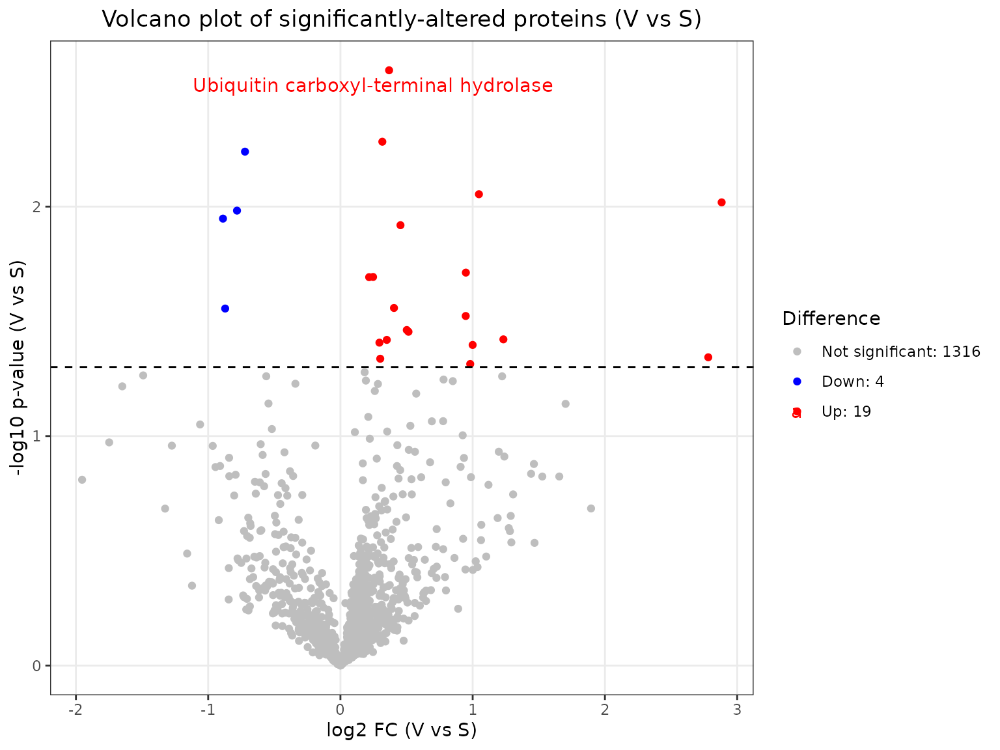

You can do it also with the results of the *GCP_ANOVA* post-hoc using
the p-value of a pairwise group comparison and the same pairwise Fold
Change obtained from the *GCP_FoldChange_Multi*: just write the name of
the p-value column in the x_val argument, and the name of the logFC
column in the y_val argument.

Then, we might want to perform an heat map only on statistically
significantly different proteins between the two groups (let’s consider
again the original two groups for this example). We can keep only
significant proteins with *GCP_FilterProteins*:

``` r

GCPlist12f <- GCP_FilterProteins(GCPlist = GCPlist12,
                                 operation = "ttest_Pvalues < 0.05")
#> 
#>                                         intensities
#> Initially, the number of proteins were         1339
#> after ttest_Pvalues < 0.05                       23
```

And so we run *GCP_HeatMap*. I know it’s a function with a of
overwhelming assemble of arguments, but trust me they are there to offer
you the maximum personalisation of the HeatMap. I would mention some: -
name_column_groups: here it can be more than one! If more categorisation
of the samples are passed (as column names of the sampleINFO table),
multiple bars will be showed! - name_column_groups_protein: exactly the
same of name_column_groups, but for proteins, so for column names of
proteinINFO! Use it if you have proteins belonging to certain
categories. - col_pal_list: pass the colors you want for those groups as
a list!

``` r

Fig14_The_Heat_Map_sign <- GCP_HeatMap(GCPlist = GCPlist12f,
                                       name_column_groups = c("Condition", "Replicate"),
                                       name_column_labels = "Sample",
                                       name_column_groups_protein = NULL,
                                       name_column_labels_protein = "Protein names",
                                       name_rows = FALSE,
                                       name_columns = TRUE,
                                       rotate_name_columns = TRUE,
                                       col_pal_list = list(Condition = c(S = "green", V = "blue"),
                                                           Replicate = c("lightskyblue", "lightskyblue1", "lightskyblue2", "lightskyblue3", "lightskyblue4")))
#> 
#>  -- The name_column_groups considered is c('Condition', 'Replicate') --
#> 
#> 
#>  -- col_pal_list is a list of colors:
#> $Condition
#>       S       V 
#> "green"  "blue" 
#> 
#> $Replicate
#> [1] "lightskyblue"  "lightskyblue1" "lightskyblue2" "lightskyblue3"
#> [5] "lightskyblue4"
#> 
#> --
# export_figures(Fig14_The_Heat_Map_sign)

print(Fig14_The_Heat_Map_sign)
```

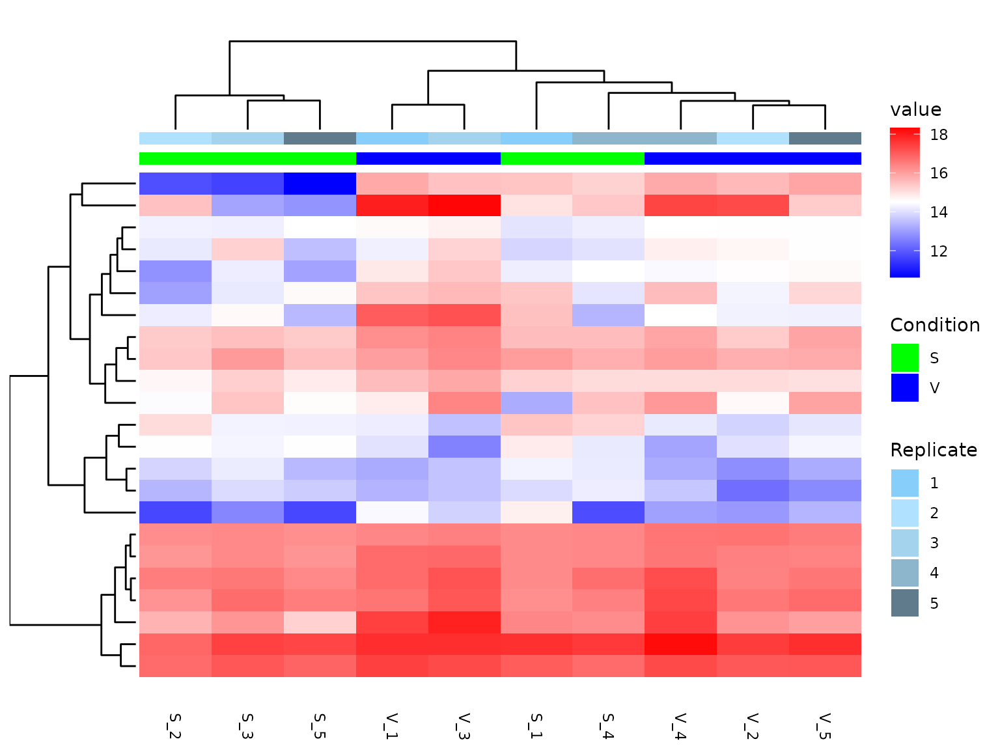

Still working only on significant proteins, we could now perform
box-plots sample-wise, so showing the distribution of single proteins in
all the samples grouped by conditions (while the box-plots we saw before
were protein-wise, i.e.: showing the distributions of all the protein
intensities in each sample). To do it, the function is the same,
*GCP_BoxPlots*, but just set the argument ‘by_samples’ as FALSE. Watch
out that this will create a list of ggplot objects, one for each
protein, and what is exported as indicated in the code below will be
single file for each of those.

``` r

Fig15_BoxPlots_sign <- GCP_BoxPlots(GCPlist = GCPlist12f,
                                    by_samples = FALSE)
#> 
#>  -- The name_column_groups considered is 'Condition' --
#> 
#>  --- col_pal is  c(S = "green", V = "orange") ---
# export_figures(Fig15_BoxPlots_sign)                            ## exporting each box-plot as a single png file
# export_figures(Fig15_BoxPlots_sign, exprt_fig_type = "pdf")    ## exporting all box-plots in a pdf file with many pages

print(Fig15_BoxPlots_sign[1:4])
#> $prot000041
```

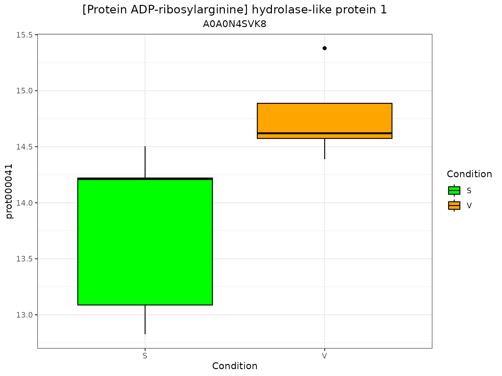

    #> 
    #> $prot000044

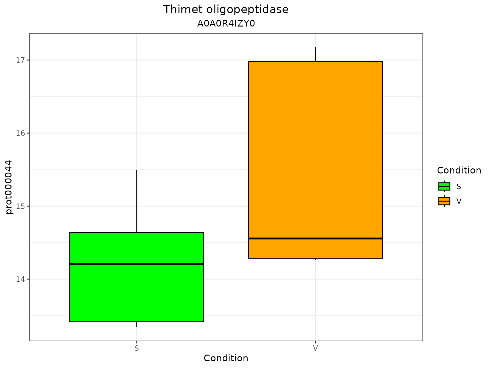

    #> 
    #> $prot000124

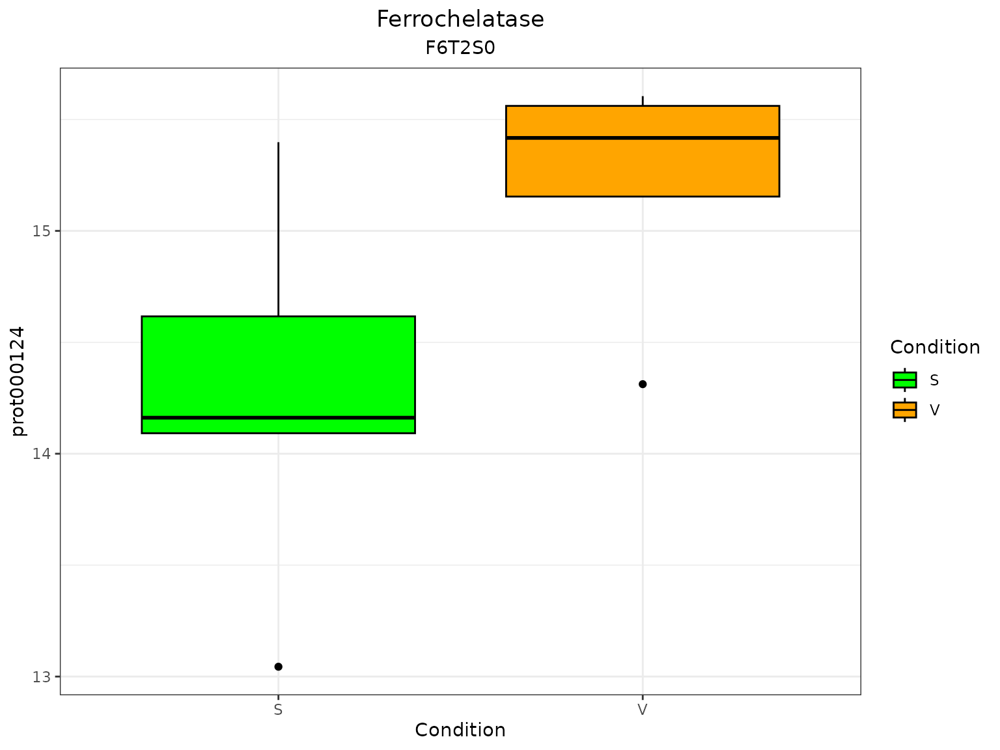

    #> 
    #> $prot000253

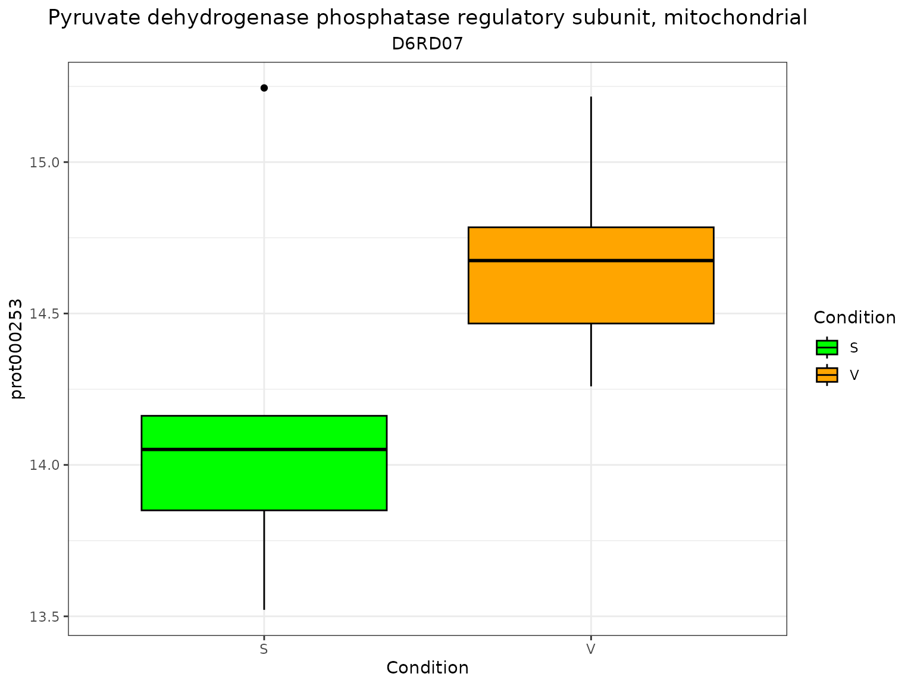

### export

Working on R is really amazing, isn’t it?!! But I guess at some point
you want to export these elaborations so you can better visualise the
big tables, don’t you? You can do it at any time with the function
*ExportGCPlist*. You can export in different ways, and you can either
export a single GCPlist or multiple GCPlists at once.

To export a single GCPlist. - pass it to the first argument of
*ExportGCPlist*. - In the second argument, ‘filename’, put the name of
the file that will be created (must ends in “.txt”, “.csv”, or
“.xlsx”). - In the third argument, ‘exportype’ you can choose if you
want to export the intensities, proteinINFO, or sampleINFO table.
Moreover, if you select “all”, intensities and proteinINFO will be put
together and exported together! Moreover, if you select “sheets”, all of
them will be exported in three different sheets of an Excel file. -
additional arguments include ‘intensity_indication’, ‘protgenenames’,
‘protIDclean’, ‘specific_columns’ which give you the possibility of some
more personalisation, check the full documentation for those, or leave
the default settings, hopefully you will like the outcome anyways!

Since you don’t necessarly need all those arguments, here the simplest
code to export efficiently a single GCPlist. This simple command will
export: protid, Accession, Protein names, Gene names, the intensities,
and all the results we computed (such as the Shapiro-Wilk test, the
presence of protein per group, the Principal Components, the t-test, the
Fold Change…):

``` r

ExportGCPlist(GCPlist12, "GCPlist12_single_export.txt")
```

To export at once multiple GCPlists, just pass a list of such lists to
the first argument and indicate a file name that ends with “.xlsx” in
the second argument. This is really cool!

``` r

GCPlist_of_lists <- list(asimported = GCPlist00,
                         `before processing` = GCPlist04,
                         `post processing` = GCPlist09,
                         with_statistics = GCPlist12,
                         with_mock_ANOVA = GCPlist12a2,
                         with_mock_batchcorr = GCPlist09b2)

ExportGCPlist(GCPlist_of_lists, "GCPlists_multiple_export.xlsx")
```

## Post-translational modifications (PTMs)

A key highlight of this package is that it elaborates data from
post-translational modifications (PTMs) experiment. The two functions
specifically developed for that are: *ImportPTMs* and
*GCP_ratioPTMprotein*. In the example below we’ll be using the first one
at the beginning and the latter at the end, in the middle we’ll be using
a bunch of the functions we already saw!

To import a dataset, the function *ImportPTMs* is very very similar to
*ImportOutputMaxQuant* we saw. The only two particular arguments of
*ImportPTMs* are: - ‘pattern_intensity’, which should be the character
contained in the intensity columns to uniquely identify them: in our
example they are “Intensity S1”, “Intensity S2”, “Intensity S3” … so we
can use “Intensity” as ‘pattern_intensity’. - ‘pattern_isoforms’, if you
also want to import the different isoforms of each peptide (due to
missed cleavages) as separate rows, in addition to the previous
argument, also specify here the pattern that can identify the different
isoforms of peptides: in our example “Intensity S1\_**1”, ”Intensity
S1**\_2”, “Intensity S1\_**3”, … so we can use ”**\_” as such pattern.
The object created will still be a GCPlist (a list with the three
tables: intesities, proteinINFO, and sampleINFO).

``` r

proteinGroupsPTM_path <- system.file("extdata", "AcetylKSites_vignettes.txt.gz", package = "GetCoolProteopipe")

GCPlistPTM00 <- ImportPTMs(MaxQuant_table_name = proteinGroupsPTM_path,     ## you can just put the name of your file in your current working directory
                           samples_info = NULL,                             ## also here potentially
                           fasta_database = "mouse",
                           prioritize_MaxQuant_names = TRUE,
                           pattern_intensity = "Intensity ",
                           pattern_isoforms = "___")
#> Rows: 227 Columns: 151
#> ── Column specification ────────────────────────────────────────────────────────
#> Delimiter: "\t"
#> chr  (35): Proteins, Positions within proteins, Leading proteins, Protein, P...
#> dbl (115): Localization prob, Score diff, PEP, Score, Delta score, Score for...
#> lgl   (1): Fasta headers
#> 
#> ℹ Use `spec()` to retrieve the full column specification for this data.
#> ℹ Specify the column types or set `show_col_types = FALSE` to quiet this message.
#> 
#> ___
#> Considering the pattern_intensity 'Intensity ', and the pattern_isoforms '___' the following sample intensities were considered:
#>  'Intensity S1'
#>  'Intensity S2'
#>  'Intensity S3'
#>  'Intensity S4'
#>  'Intensity S5'
#>  'Intensity V1'
#>  'Intensity V2'
#>  'Intensity V3'
#>  'Intensity V4'
#>  'Intensity V5'
#> 
#> repeated for the following isoforms:
#>  '___1'
#>  '___2'
#>  '___3'
#> 
#> ___
```

Let’s further improve the sample names using *GCP_ChangeSampleNames*:

``` r

GCPlistPTM01 <- GCP_ChangeSampleNames(GCPlist = GCPlistPTM00,
                                      old_names = GCPlistPTM00$sampleINFO$Sample,
                                      new_names = c("S_1", "S_2", "S_3", "S_4", "S_5", "V_1", "V_2", "V_3", "V_4", "V_5"))
#> 
#> ______
#> The name of samples have been updated in this way:
#> 
#>    ORIGINAL_NAMES NAMES_UPDATED    COMMENT
#> 1    Intensity S1           S_1   Changed!
#> 2    Intensity S2           S_2   Changed!
#> 3    Intensity S3           S_3   Changed!
#> 4    Intensity S4           S_4   Changed!
#> 5    Intensity S5           S_5   Changed!
#> 6    Intensity V1           V_1   Changed!
#> 7    Intensity V2           V_2   Changed!
#> 8    Intensity V3           V_3   Changed!
#> 9    Intensity V4           V_4   Changed!
#> 10   Intensity V5           V_5   Changed!
#> ______
```

Followed by a similar workflow to the one we previously saw:

``` r

GCPlistPTM02 <- GCP_AssignGroups(GCPlist = GCPlistPTM01,
                                 automatic_assignment = "groupfirst",
                                 separator_automatic_assignment = "_",
                                 name_column_groups = "Condition",
                                 controlgroup = "S")
#> 
#> ______
#> The groups have been assigned in the sampleINFO dataframes in the column named Condition, in this way:
#>    Sample Condition Replicate
#> 1     S_1         S         1
#> 2     S_2         S         2
#> 3     S_3         S         3
#> 4     S_4         S         4
#> 5     S_5         S         5
#> 6     V_1         V         1
#> 7     V_2         V         2
#> 8     V_3         V         3
#> 9     V_4         V         4
#> 10    V_5         V         5
#> 
#> 
#> The order of the levels is the following: S V
#> ______
```

``` r

set_name_column_groups("Condition")
#> 
#>  --- the name_column_groups is now set to be 'Condition' ---
```

``` r

GCPlistPTM03 <- GCP_RemoveAllZero(GCPlistPTM02)
#> 
#> ___
#> There are 451 rows with all zero in the intensity table, which have been removed.
#> 
#> Thus, 230 out of 681 proteins were kept.
#> ___
```

``` r

GCPlistPTM04 <- GCP_ReplaceZerowithNA(GCPlistPTM03)
#> 
#> ______
#> The number of zeros replaced with NAs is
#>  - 933 out of 2300 (40.6%).
#> ______
```

``` r

GCPlistPTM05 <- GCP_LogTransformIntensities(GCPlist = GCPlistPTM04)
#> 
#>  -- The base of the logarithm considered is 2 --
#> 
#> 
#> ______
#> All intensities have been transformed using the logarithm base 2.
#> ______
```

``` r

GCPlistPTM06 <- GCP_FilterNAperCondition(GCPlist = GCPlistPTM05,
                                         ratio = 0.5)
#> 
#>  -- The name_column_groups considered is 'Condition' --
#> 
#> 
#> _____________________
#> For the intensities table:
#> - 130 out of 230 where suitable for S.
#> - 139 out of 230 where suitable for V.
#> --> Overall, 156 out of 230 have been kept in the intensities table.
#> ___________________
```

``` r

GCPlistPTM07 <- GCP_NAimputation(GCPlist = GCPlistPTM06,
                                 quant_rate = 0.5)
#> 
#>  -- The name_column_groups considered is 'Condition' --
#> 
#> 
#> ______
#> In the intensities table, the number of NAs is:
#> - 359 / 1560 (23%), initially.
#> - 149 / 1560 (9.6%), after the scImpute.
#> - 0 / 1560 (0%), after the tImpute.
#> ______
```

``` r

GCPlistPTM08 <- GCP_ScaleIntensities(GCPlist = GCPlistPTM07,
                                  subtract = "shift_median",
                                  divide = "sqrt_sd",
                                  by_sample = TRUE)
#> 
#>  -- The name_column_groups considered is 'Condition' --
#> 
#> 
#> ______
#> Intensities have been, by sample,
#>  centered to the global median for each sample group (according to the 'Condition' column),
#>  divided by the square root of the standard deviation.
#> ______
```

So, the peculiar function *GCP_ratioPTMprotein* will do something
fundamental and unique. It has two simple arguments we must fill: a
GCPlist created from PTMs and a GCPlist created from proteins. Then, for
each feature intensity of the PTM, it will check if there is a
corresponding protein based on a matching Accession number and, if there
is, it will divide those intensities. If there is not, it will simple
remove those intensities. There is actually a third argument: if the
data are log-transformed (such in our example) set ‘are_log_transf’ as
TRUE, so the subtraction will be performed instead of the division.

``` r

GCPlistPTM09 <- GCP_ratioPTMprotein(GCPlistPTM = GCPlistPTM08,
                                    GCPlistProteins = GCPlist12,
                                    are_log_transf = TRUE)
#> 
#> 
#>   29 out of 156 has been removed as there is no correspondence with any Accession in the protein table:
#>           protid   Accession
#> 1  PTM000000___1  A0A087WR13
#> 2  PTM000001___1  A0A087WR13
#> 3  PTM000016___1  A0A140LIW0
#> 4  PTM000034___1        <NA>
#> 5  PTM000038___1      B2RY04
#> 6  PTM000042___1      E9PV66
#> 7  PTM000043___1      G3X9F7
#> 8  PTM000047___1      F6UFZ5
#> 9  PTM000049___1      Q7M739
#> 10 PTM000050___1      F7CC56
#> 11 PTM000192___1    Q8BPM0-2
#> 12 PTM000202___1      Q99MY8
#> 13 PTM000206___1      Q9CUU3
#> 14 PTM000207___1      Q9CUU3
#> 15 PTM000215___2      Q9JIA9
#> 16 PTM000216___2      Q9JIA9
#> 17 PTM000225___2 REV__Q9D4B2
#> 18 PTM000226___2 REV__Q9D4B2
#> 19 PTM000021___3  A0A286YDI4
#> 20 PTM000022___3  A0A286YDI4
#> 21 PTM000023___3  A0A286YDI4
#> 22 PTM000024___3  A0A286YDI4
#> 23 PTM000187___3    Q80YE7-2
#> 24 PTM000188___3    Q80YE7-2
#> 25 PTM000189___3    Q80YE7-2
#> 26 PTM000221___3      Q9Z1A9
#> 27 PTM000222___3      Q9Z1A9
#> 28 PTM000223___3      Q9Z1A9
#> 29 PTM000224___3      Q9Z1A9
```

Great! We can then apply statistics and other stuff as already
described, but I don’t want to repeat myself, so let’s export what we
got and we are done!

``` r

GCPlist_of_PTMlists <- list(asimported = GCPlistPTM00,
                            `before processing` = GCPlistPTM04,
                            `post processing` = GCPlistPTM08,
                            with_ratio_protein = GCPlistPTM09)
ExportGCPlist(GCPlist_of_PTMlists, "GCPlistsPTM_multiple_export.xlsx")
```

I hope this vignettes was useful for you and that you enjoy using this
package as much as I enjoyed programming it! For any question on the
functions don’t hesitate to contact me, while for any question on the
proteomics workflow don’t hesitate to contact Clarissa!

Long life unicorns and see you at the next package!!
